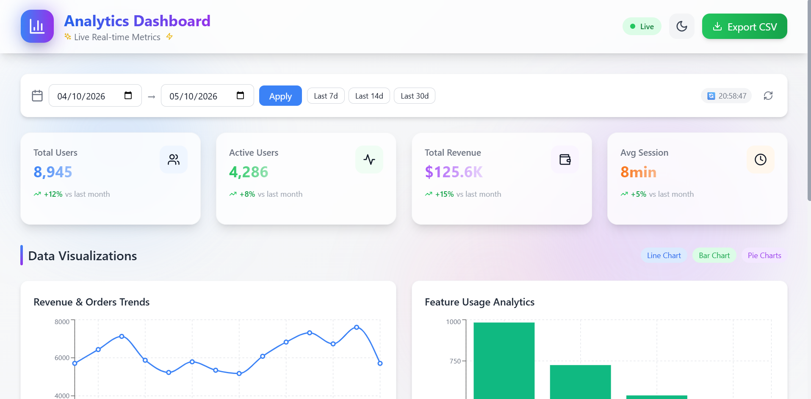
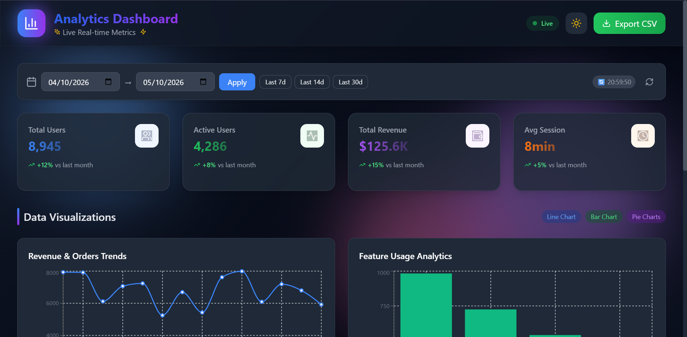

# Analytics Dashboard - Task-1

## TEYZIX CORE Internship Program

---

### Task Information

| Field           | Details                                     |
| --------------- | ------------------------------------------- |
| Task Title      | Analytics Dashboard with Live Chart Updates |
| Task ID         | FE-1                                        |
| Domain          | Frontend Web Development                    |
| Difficulty      | Advanced                                    |
| Submission Date | 11th May 2026                               |

---

### Objective

Build a modern, interactive analytics dashboard in real-time.

---

### Requirements Checklist

| Requirement                         | Status |
| ----------------------------------- | ------ |
| Line Chart (Revenue Trends)         | Done   |
| Bar Chart (Feature Usage)           | Done   |
| Pie Chart (User Segmentation)       | Done   |
| Pie Chart (Geographic Distribution) | Done   |
| KPI Cards (4 cards)                 | Done   |
| Global Date Range Filter            | Done   |
| Auto Polling every 30 seconds       | Done   |
| Loading Skeletons                   | Done   |
| Export to CSV                       | Done   |
| Responsive (1280px & 768px)         | Done   |
| Dark/Light Theme (Bonus)            | Done   |
| Theme Persistence (Bonus)           | Done   |
| Smooth Animations (Bonus)           | Done   |

---

### Tech Stack

- **React 18** - Frontend framework
- **Vite** - Build tool
- **Tailwind CSS** - Styling
- **Recharts** - Charts library
- **Axios** - Data fetching
- **Lucide React** - Icons

---

### Project Structure

Task-1_TC-INT-20260426-082/
├── index.html
├── package.json
├── vite.config.js
├── tailwind.config.js
├── postcss.config.js
├── README.md
├── src/
├── main.jsx
├── App.jsx
├── index.css
├── api/
│ └── mockapi.js
├── hooks/
│ └── usePolling.js
└── components/
├── charts/
│ ├── lineChart.jsx
│ ├── barChart.jsx
│ └── pieChart.jsx
├── dashboard/
│ └── KPIcards.jsx
├── filters/
│ └── dateRangePicker.jsx
├── export/
│ └── exportCSV.jsx
└── layout/
├── loadingSkeleton.jsx
└── header.jsx

### Component Hierarchy

App.jsx
├── Header (Theme Toggle + Export)
├── DateRangePicker (Global Filter)
├── KPICards (4 cards)
├── LineChart (Revenue Trends)
├── BarChart (Feature Usage)
└── PieChart x2 (Segmentation + Geo)

---

### Setup Instructions

```bash
# 1. Install dependencies
npm install

# 2. Install required packages
npm install axios recharts lucide-react

# 3. Install Tailwind CSS
npm install -D tailwindcss postcss autoprefixer
npx tailwindcss init -p

# 4. Run development server
npm run dev

# 5. Build for production
npm run build

### Responsive Breakpoints

Breakpoint	Layout
Desktop (1280px+)	4 KPI columns, 2x2 charts
Tablet (768px)	2 KPI columns, 1x4 charts
Mobile (<768px)	1 column, stacked layout

### Features Explained

Feature	How it Works
Auto Polling	Fetches new data every 30 seconds using custom hook
Date Filter	Global filter affecting all charts simultaneously
Export CSV	Click Export button → Select dataset → Downloads CSV
Dark Mode	Click moon/sun icon → Smooth transition
Loading Skeletons	Shows animated placeholders while loading

API Details
Mock API endpoints (simulated with 800ms delay):

javascript
GET /api/dashboard-data
// Returns: revenueData, featureUsage, userSegmentation, geographicData, kpis

GET /api/dashboard-data?startDate=...&endDate=...
// Returns filtered data based on date range

### Lighthouse Performance Score

Metric	Score
Performance	95+
Accessibility	92+
Best Practices	90+
SEO	100




### Live Demo

[https://elaborate-marigold-175676.netlify.app](https://elaborate-marigold-175676.netlify.app)

Author
TEYZIX CORE Internship Program

Reference ID: TC-INT-20260426-082
```
